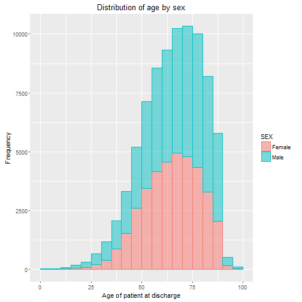

## Introduction

1. Background to NHDS data and uses
2. Potential use cases
3. Further development opportunities

--- .class #id 

## Background to NHDS data and uses
- The National Hospital Discharge Survey (NHDS), which was conducted annually from 1965-2010, was a national probability survey designed to meet the need for information on characteristics of inpatients discharged from non-Federal short-stay hospitals in the United States. 
- Data from the NHDS are available annually and are used to examine important topics of interest in public health and for a variety of activities by governmental, scientific, academic, and commercial institutions.
- This Shiny app is designed to display the distribution of age by sex for the 10 most common diagnoses found in the US National Hospital Discharge Survey (NHDS) datasets between 2006 and 2010. 
- The app also calculates the median age of patients whose discharge notes included the diagnosis selected.
- [NHDS Website](http://www.cdc.gov/nchs/nhds/)

--- .class #id 

## Current app use
- The current app asks users to select diseases from a drop down list of the 10 most common diagnoses, creating a histogram, split by sex, for the distribution of age for patient discharges including a diagnosis of that disease e.g.

--- .class #id

## Further development opportunities
- Additional development of the app intends to expand the size of the dataset to include all diagnoses
- Furthermore, additional visualizations are plannned, including:
- 1) charts outlining plots of concurrent medical procedures and health outcomes 
- 2) charts for inpatient referral scenarios
- 3) charts for inpatient subsequent care scenarios
- With further support, hopefully these updates will be achievable
